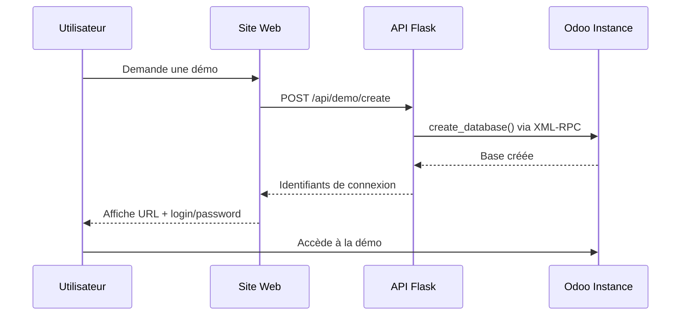

# 🚀 Système d'Automatisation de Démos Odoo 19

Ce système vous permet de créer automatiquement des instances de démo Odoo 19 gratuites pour vos utilisateurs via votre site web.

## 📋 Architecture

Le système utilise l'approche **Multi-Tenant** :
- ✅ Une seule instance Odoo sur Railway = un seul coût
- ✅ Chaque utilisateur obtient sa propre base de données PostgreSQL isolée
- ✅ Création en quelques secondes via l'API XML-RPC d'Odoo
- ✅ Nettoyage automatique des démos expirées

## 🛠️ Composants

### 1. `create_demo.py`
Script Python pour créer manuellement des démos Odoo.

**Utilisation :**
```bash
python create_demo.py
```

**Fonctionnalités :**
- Création de bases de données Odoo avec identifiants aléatoires
- Génération automatique de mots de passe sécurisés
- Définition de la durée de validité (défaut: 72h)
- Liste de toutes les bases de données
- Suppression de bases de données

### 2. `cleanup_expired.py`
Script pour nettoyer automatiquement les démos expirées.

**Utilisation :**
```bash
# Mode dry-run (voir ce qui serait supprimé)
python cleanup_expired.py

# Pour vraiment supprimer (décommentez dans le code)
python cleanup_expired.py
```

**Configuration avec Cron (recommandé) :**
```bash
# Exécuter toutes les heures
0 * * * * cd /path/to/demo_automation && python3 cleanup_expired.py
```

### 3. `api_flask.py`
API Flask pour créer des démos depuis votre site web.

**Endpoints :**

#### POST `/api/demo/create`
Crée une nouvelle démo Odoo.

**Headers :**
```
Content-Type: application/json
X-API-Key: votre-cle-api-secrete
```

**Body :**
```json
{
  "email": "utilisateur@example.com",
  "name": "Nom de l'utilisateur",
  "phone": "+33612345678",
  "duration_hours": 72
}
```

**Response (201) :**
```json
{
  "success": true,
  "demo": {
    "url": "https://ezaynova2-production.up.railway.app/web?db=demo_20240101_120000_abcd",
    "login": "admin",
    "password": "aB3dE5fG7hI9jK1l",
    "db_name": "demo_20240101_120000_abcd",
    "expires_at": "2024-01-04T12:00:00",
    "expires_in_hours": 72
  }
}
```

#### GET `/api/demo/stats`
Retourne des statistiques sur les démos.

#### GET `/api/demo/list`
Liste toutes les démos actives.

### 4. `example_website.html`
Page HTML d'exemple montrant comment intégrer le système sur votre site web.

**Fonctionnalités :**
- Formulaire élégant pour demander une démo
- Appel AJAX vers l'API Flask
- Affichage des identifiants de connexion
- Design responsive et moderne

## 🚀 Installation et Déploiement

### Option A : Utilisation locale (pour tester)

1. **Installer les dépendances :**
   ```bash
   cd demo_automation
   pip install -r requirements.txt
   ```

2. **Configurer les variables d'environnement :**
   ```bash
   export ODOO_URL="https://ezaynova2-production.up.railway.app"
   export MASTER_PASSWORD="VotreMotDePasseSecurise123!"
   export API_KEY="votre-cle-api-secrete-aleatoire"
   ```

3. **Lancer l'API Flask :**
   ```bash
   python api_flask.py
   ```

4. **Tester avec curl :**
   ```bash
   curl -X POST http://localhost:5000/api/demo/create \
     -H "Content-Type: application/json" \
     -H "X-API-Key: votre-cle-api-secrete" \
     -d '{
       "email": "test@example.com",
       "name": "Test User",
       "duration_hours": 72
     }'
   ```

### Option B : Déploiement sur Railway (recommandé)

1. **Créer un nouveau service Railway :**
   - Allez sur https://railway.app/dashboard
   - Cliquez sur "New Project"
   - Sélectionnez "Deploy from GitHub repo"
   - Choisissez le dossier `demo_automation`

2. **Configurer les variables d'environnement dans Railway :**
   ```
   ODOO_URL=https://ezaynova2-production.up.railway.app
   MASTER_PASSWORD=VotreMotDePasseSecurise123!
   API_KEY=generer-une-cle-api-secrete-aleatoire
   PORT=8080
   ```

3. **Créer un fichier `Procfile` :**
   ```
   web: gunicorn api_flask:app
   ```

4. **Railway déploiera automatiquement l'API**

5. **Récupérer l'URL publique de l'API :**
   Railway génère une URL du type : `https://demo-api-production.up.railway.app`

### Option C : Déploiement sur Vercel (alternative gratuite)

1. **Installer Vercel CLI :**
   ```bash
   npm install -g vercel
   ```

2. **Déployer :**
   ```bash
   cd demo_automation
   vercel
   ```

3. **Configurer les variables d'environnement sur Vercel Dashboard**

## 🌐 Intégration dans votre site web

### 1. Méthode JavaScript (recommandée)

```html
<script>
const API_URL = 'https://votre-api.railway.app';
const API_KEY = 'votre-cle-api-secrete';

async function createDemo(email, name, phone) {
  const response = await fetch(`${API_URL}/api/demo/create`, {
    method: 'POST',
    headers: {
      'Content-Type': 'application/json',
      'X-API-Key': API_KEY
    },
    body: JSON.stringify({ email, name, phone, duration_hours: 72 })
  });

  const data = await response.json();

  if (data.success) {
    console.log('Démo créée:', data.demo);
    window.open(data.demo.url, '_blank');
  }
}

// Utilisation
createDemo('user@example.com', 'John Doe', '+33612345678');
</script>
```

### 2. Méthode PHP

```php
<?php
$api_url = 'https://votre-api.railway.app/api/demo/create';
$api_key = 'votre-cle-api-secrete';

$data = [
    'email' => 'user@example.com',
    'name' => 'John Doe',
    'phone' => '+33612345678',
    'duration_hours' => 72
];

$ch = curl_init($api_url);
curl_setopt($ch, CURLOPT_RETURNTRANSFER, true);
curl_setopt($ch, CURLOPT_POST, true);
curl_setopt($ch, CURLOPT_POSTFIELDS, json_encode($data));
curl_setopt($ch, CURLOPT_HTTPHEADER, [
    'Content-Type: application/json',
    "X-API-Key: $api_key"
]);

$response = curl_exec($ch);
curl_close($ch);

$result = json_decode($response, true);

if ($result['success']) {
    echo "Démo créée: " . $result['demo']['url'];
}
?>
```

### 3. Méthode Python (backend)

```python
import requests

API_URL = 'https://votre-api.railway.app'
API_KEY = 'votre-cle-api-secrete'

def create_demo(email, name, phone):
    response = requests.post(
        f'{API_URL}/api/demo/create',
        headers={
            'Content-Type': 'application/json',
            'X-API-Key': API_KEY
        },
        json={
            'email': email,
            'name': name,
            'phone': phone,
            'duration_hours': 72
        }
    )

    data = response.json()
    return data['demo'] if data['success'] else None

# Utilisation
demo = create_demo('user@example.com', 'John Doe', '+33612345678')
print(f"URL: {demo['url']}")
```

## 🔄 Workflow complet



## 📊 Monitoring et Statistiques

### Obtenir des statistiques

```bash
curl -X GET https://votre-api.railway.app/api/demo/stats \
  -H "X-API-Key: votre-cle-api-secrete"
```

**Response :**
```json
{
  "active_demos": 15,
  "expired_demos": 3,
  "total_created": 120,
  "total_deleted": 105
}
```

### Lister toutes les démos

```bash
curl -X GET https://votre-api.railway.app/api/demo/list \
  -H "X-API-Key: votre-cle-api-secrete"
```

## 🛡️ Sécurité

### Bonnes pratiques :

1. **Générer une clé API forte :**
   ```bash
   python3 -c "import secrets; print(secrets.token_urlsafe(32))"
   ```

2. **Ne jamais exposer la clé API côté client**
   - ❌ Ne pas mettre la clé dans le code JavaScript
   - ✅ Appeler l'API depuis votre backend

3. **Limiter le taux de création :**
   Ajoutez un rate limiting dans l'API Flask :
   ```python
   from flask_limiter import Limiter
   limiter = Limiter(app, default_limits=["10 per hour"])
   ```

4. **Vérifier l'email avec un CAPTCHA :**
   Intégrez Google reCAPTCHA avant de créer une démo.

## 🧹 Nettoyage automatique

### Setup du Cron Job sur le serveur

1. **Installer le cron job :**
   ```bash
   crontab -e
   ```

2. **Ajouter la ligne :**
   ```
   0 * * * * cd /home/user/EZAYNOVA2/demo_automation && /usr/bin/python3 cleanup_expired.py >> /tmp/cleanup.log 2>&1
   ```

3. **Vérifier les logs :**
   ```bash
   tail -f /tmp/cleanup.log
   ```

## 💰 Coûts estimés

### Railway pricing :
- **Instance Odoo + PostgreSQL** : ~$10-20/mois (selon l'usage)
- **API Flask** : ~$5/mois ou gratuit (Hobby plan)
- **Total** : ~$15-25/mois pour des démos illimitées

### Alternative gratuite :
- Déployer l'API sur Vercel (gratuit)
- Garder seulement Odoo + PostgreSQL sur Railway

## 📧 Notifications par Email

Pour envoyer automatiquement les identifiants par email, ajoutez dans `api_flask.py` :

```python
import smtplib
from email.mime.text import MIMEText

def send_demo_email(email, demo_info):
    msg = MIMEText(f"""
    Votre démo Odoo 19 est prête !

    URL: {demo_info['url']}
    Login: admin
    Password: {demo_info['password']}

    Valable jusqu'au: {demo_info['expires_at']}
    """)

    msg['Subject'] = 'Votre démo Odoo gratuite'
    msg['From'] = 'noreply@votredomaine.com'
    msg['To'] = email

    # Configurer votre serveur SMTP
    with smtplib.SMTP('smtp.gmail.com', 587) as server:
        server.starttls()
        server.login('your-email@gmail.com', 'your-password')
        server.send_message(msg)
```

## 🎯 Prochaines améliorations

- [ ] Interface d'administration web pour gérer les démos
- [ ] Système de prolongation de démo
- [ ] Export automatique des statistiques
- [ ] Notifications Slack/Discord pour nouvelles démos
- [ ] Rate limiting par IP
- [ ] Support de modules Odoo personnalisés pré-installés

## 📞 Support

Pour toute question ou problème, contactez-nous ou consultez la documentation Odoo :
- https://www.odoo.com/documentation/19.0/
- https://www.odoo.com/documentation/19.0/developer/reference/backend/orm.html

## 📄 Licence

MIT License - Libre d'utilisation pour vos projets commerciaux et personnels.
